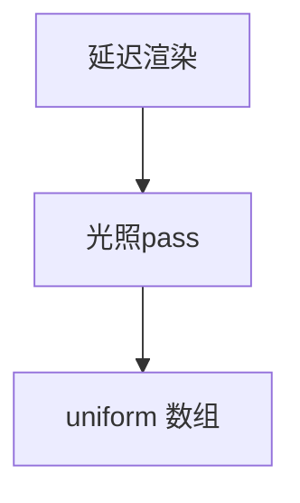

# Todo
## [branch]
### 修改imgui界面，添加菜单栏，可以添加关于等
### 美化imgui界面配色

## [main]
### 1.

```mermaid
graph TD
    1[延迟渲染]
    2[光照pass]
    3[uniform 数组]
    1-->2
    2-->3
```
### 改名叫Nexus Engine
1.改标题
2.改命名空间为NexNgin