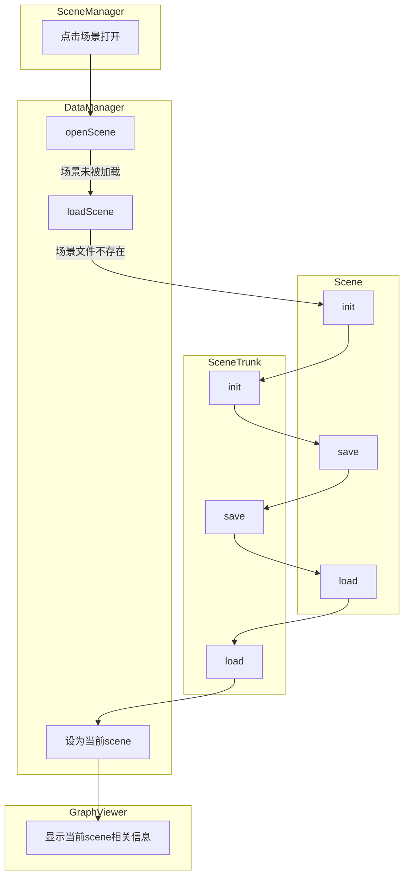

# 打开一个全新的场景的协作图

```mermaid
graph TB
    subgraph SceneManager 
        a[点击场景打开]
    end
    subgraph DataManager
        openScene
        a-->openScene
        openScene-->|"场景未被加载"|loadScene
    end
    subgraph Scene
        loadScene-->|"场景文件不存在"|init
    end
    subgraph SceneTrunk
        init-->trunkInit["init"]
        trunkSave["save"]
    end
    subgraph Scene
        trunkInit-->save
        save-->trunkSave
        load
    end
    subgraph SceneTrunk
        trunkSave-->load
        load-->trunkLoad["load"]
    end

    subgraph DataManager
        trunkLoad-->b[设为当前scene]
    end
    
    subgraph GraphViewer 
        b-->c[显示当前scene相关信息]
    end
```