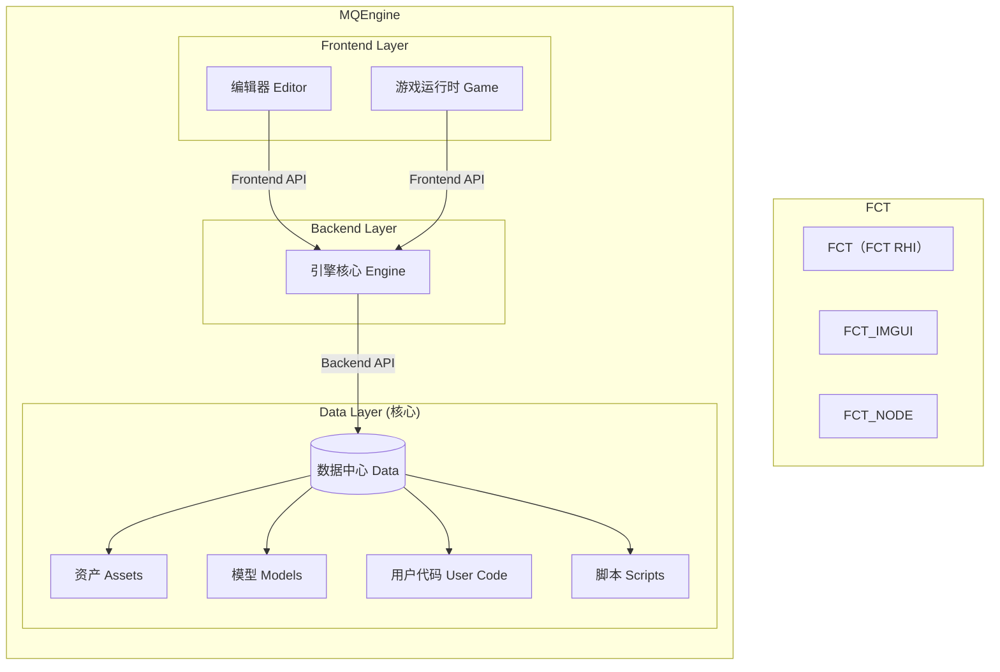

# 引擎架构

MQEngine 采用分层架构设计，以数据层为核心，各个组件围绕数据进行组织，确保高效的数据流转和模块间的松耦合。

## 🏗️ 整体架构概览

```mermaid
graph TB

    subgraph "FCT"
        direction LR
        FCT_RHI[FCT（FCT RHI）]
        FCT_IMGUI
        FCT_NODE
    end
    
    subgraph "MQEngine"
        direction TB
        subgraph "Frontend Layer"
            Editor[编辑器 Editor]
            Game[游戏运行时 Game]
        end

        subgraph "Backend Layer"
            Engine[引擎核心 Engine]
        end

        subgraph "Data Layer (核心)"
            Data[(数据中心 Data)]
            Assets[资产 Assets]
            Models[模型 Models]
            UserCode[用户代码 User Code]
            Scripts[脚本 Scripts]
        end

        Editor -->|Frontend API| Engine
        Game -->|Frontend API| Engine
        Engine -->|Backend API| Data

        Data --> Assets
        Data --> Models
        Data --> UserCode
        Data --> Scripts
    end
    

```
